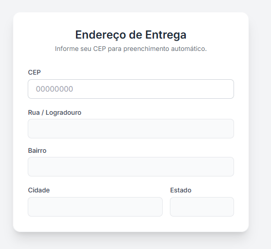

# 📦 Busca CEP - Auto-complete de Endereço


> Uma interface elegante para busca automática de endereços via CEP, consumindo a API ViaCEP com JavaScript puro (Vanilla JS).


---

## 🚀 Sobre o Projeto

Este projeto foi desenvolvido com o objetivo de criar um formulário de cadastro de endereço com foco em **UX (Experiência do Usuário)** e **Código Limpo**. Ao terminar de digitar o CEP e  clicar fora do campo cep o formulário preenche automaticamente os campos de Rua, Bairro, Cidade e Estado.

### ✨ Funcionalidades

- **Busca Automática:** Consumo da API ViaCEP via `fetch`.
- **Feedback Visual:** Estado de "Carregando" (spinner) enquanto a requisição é feita.
- **Tratamento de Erros:** Mensagens claras caso o CEP não exista ou seja inválido.
- **UI Responsiva:** Layout adaptável para Mobile e Desktop utilizando **Tailwind CSS**.

---

## 🛠️ Tecnologias e Conceitos

- **HTML5 Semântico:** Estrutura acessível e organizada.
- **Tailwind CSS (CDN):** Estilização rápida e consistente sem necessidade de build tools complexos para este escopo.
- **JavaScript (ES6+):**
  - **Fetch API & Async/Await:** Para requisições assíncronas modernas.
  - **DOM Manipulation:** Atualização dinâmica da interface.
  - **Error Handling:** Blocos `try/catch` e tratamento de erros da API.
---


## 🚀 Como executar

Basta clonar o repositório e abrir o arquivo `index.html` no seu navegador.

```bash
# Clone este repositório
$ git clone https://github.com/Alicia-Alexia/busca_cep.git

# Acesse a pasta do projeto no terminal/cmd
$ cd busca_cep
# Abra o index.html no navegador
```

## 📂 Estrutura de Arquivos

A estrutura foi pensada para projetos estáticos, mantendo a raiz limpa e os recursos organizados:

/busca_lista_beneficios

    │
    ├── assets/              <-- Pasta principal de recursos
    │   ├── js/              <-- Pasta específica para Scripts
    │   │   └── script.js
    │   │
    │   │
    │   └── img/ 
    |        └── image.png     
    │
    ├── index.html           
    └── README.md         <-- Documentação


## 🤝 Autor
Desenvolvido por Alicia como parte de estudos em Frontend Development.